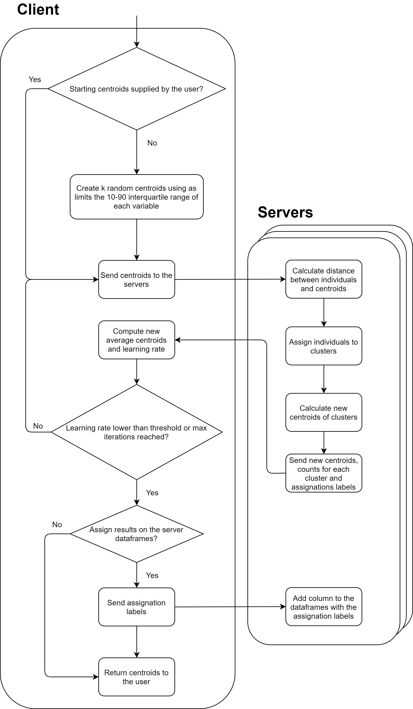
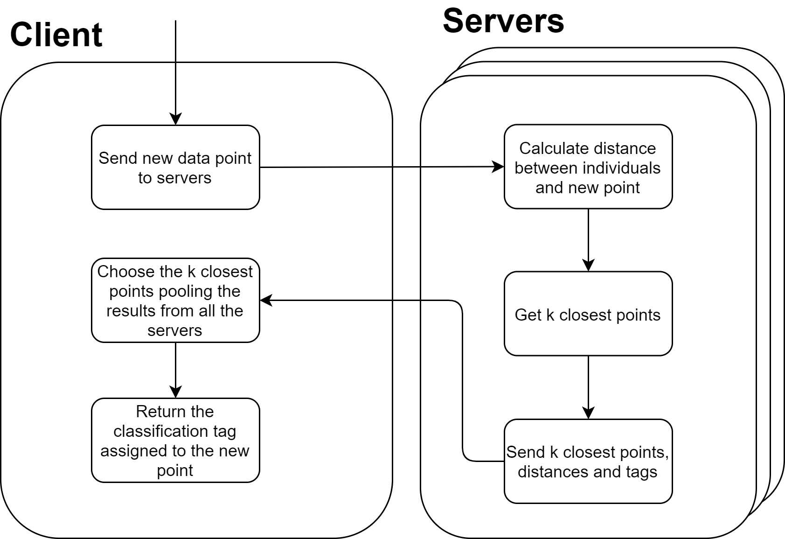
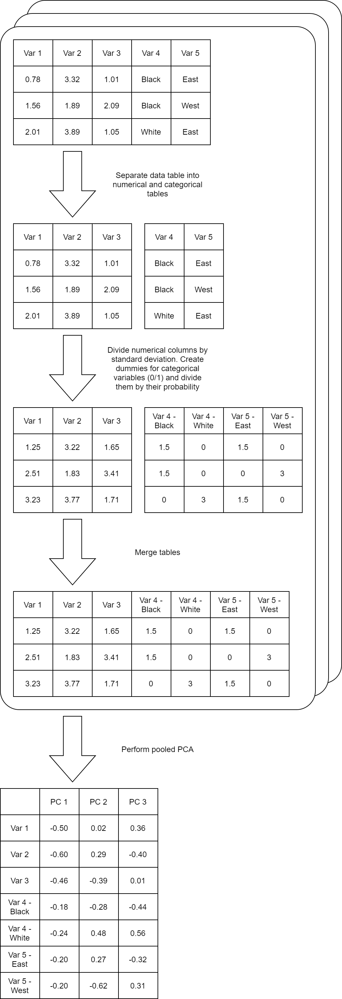

<style type="text/css">
.main-container {
  max-width: 970px;
  margin-left: auto;
  margin-right: auto;
}
</style>

```{r setup, include=FALSE}
BiocStyle::markdown()
options(width=80)
knitr::opts_chunk$set(comment="", warning=FALSE, message=FALSE, cache=FALSE)
```

# Purpose
The following document contains a description of new functions proposed for DataSHIELD, along some remarks of the disclosure control taken for each one. Examples will also be provided to portrait the usage.

# Setup
To reproduce the results displayed on this vignette, a serverless configuration will be setup to use DataSHIELD tools on a virtualized environment, this will be done through the [DSLite](https://cran.r-project.org/web/packages/DSLite/vignettes/developing-with-dslite.html) package. To start, install the dsML and dsMLClient.

```{r eval = FALSE}
devtools::install_github("isglobal-brge/dsML")
devtools::install_github("isglobal-brge/dsMLClient")
install.packages('dsBaseClient', repos=c(getOption('repos'), 'https://cran.obiba.org'))
install.packages('dsBase', repos=c(getOption('repos'), 'https://cran.obiba.org'))
```

The other required packages can be installed from CRAN.

```{r eval = FALSE}
install.packages("DSLite")
install.packages("resourcer")
```

To demostrate the new functions, a dataset will be split across two virtualized servers to portrait how the functions can operate with a distributed dataset. The data used will be the [iris]() dataset splitted between the two servers.

```{r}
data("iris")
iris1 <- iris[1:70,]
iris2 <- iris[71:150,]
```

Now the virtualized servers can be created using `DSLite`.

```{r}
library(dsBase)
library(dsBaseClient)
library(dsML)
library(dsMLClient)
library(resourcer)
library(DSLite)

dslite.server <- newDSLiteServer(tables=list(iris1 = iris1, iris2 = iris2),
                                 config = DSLite::defaultDSConfiguration(include=c("dsBase", "resourcer", "dsML")))
builder <- DSI::newDSLoginBuilder()
builder$append(server = "server1", url = "dslite.server", table = "iris1", driver = "DSLiteDriver")
builder$append(server = "server2", url = "dslite.server", table = "iris2", driver = "DSLiteDriver")
logindata.dslite.cnsim <- builder$build()

conns <- datashield.login(logindata.dslite.cnsim, assign=T, symbol = "iris")
```

When using `DSLite` we can cheat and access the actual data frames on the severs (this can not be done when using DataSHIELD on a real deployed environment, as it would obviously defeat the whole purpose of the software), we can make use of this to portray the behavior of the different functions proposed. For example we can start by checking that the splitted dataset is correctly loaded.

```{r}
lapply(getDSLiteData(conns, "iris"), head)
```

# Centering

## Definition

To transform each column into a variable having 0 mean.

## Statistical method implemented

Calculate the mean of each column and substract it to all the values of the column.

## Implementation

The `ds.mean` function of DataSHIELD has been used to get the mean of each column, those values are then subtracted to get the transformed dataset. The centering can be used as pooled or split, when using as pooled, the global mean will be calculated for each column and that value will be subtracted on each server; when using as split, the mean for each server will be computed and subtracted on each server, the means of each server will be 0 but not necessarily the global mean of the columns will be 0 when using the split approach.

The only information that the client recieves from the servers is the means, this operation has already filters to prevent disclosure. 

This function can work with data frames or with numerical vectors, when using data frames only the numerical columns will be centered, other columns (factors, characters, ...) will be dropped.

## Usage

The argument `type` can take the values `"combined"` or `"split"` to select if a pooled approach or not is desired. The `name` argument is used to assign the result of the centering to a new variable, if this argument is `NULL` the input data will be overwritten with the centering results.

```{r results = 'hide'}
# Data frame example
ds.center("iris", type = "combined", name = "iris_centered", datasources = conns)
```
```{r}
head(getDSLiteData(conns, "iris")[[1]])
head(getDSLiteData(conns, "iris_centered")[[1]])
```
```{r results = 'hide'}
# Numerical vector example
ds.center("iris$Petal.Length", type = "combined", name = "Petal.Length_center", datasources = conns)
```
```{r}
head(getDSLiteData(conns, "iris")[[1]])$Petal.Length
head(getDSLiteData(conns, "Petal.Length_center")[[1]])
```

The centering function has no output to the client, all the changes are done on the study servers.

# Scaling

## Definition

To transform a dataset so each column has unit variance.

## Statistical method implemented

Following statistics theory, to transform a set of numbers to achieve unitary variance, each value has to be divided by the group standard deviation. This method is then applied column by column on a dataset.

## Implementation

The `ds.var` function of DataSHIELD has been used to get the variance of each column (standard deviation is the square root of the variance), those values are then used to divide the dataset to achieve unitary variance. The scaling can be used as pooled or split, when using as pooled, the pooled variance will be used for each column; when using as split, the variance for each server will be computed, the standard deviation on each server will be unitary but not necessarily unitary when using the split approach.

The only information that the client receives from the servers is the variance, this operation has already filters to prevent disclosure. 

This function can work with data frames or with numerical vectors, when using data frames only the numerical columns will be scaled, other columns (factors, characters, ...) will be dropped.

## Usage

The argument `type` can take the values `"combined"` or `"split"` to select if a pooled approach or not is desired. The `name` argument is used to assign the result of the scaling to a new variable, if this argument is `NULL` the input data will be overwritten with the scaling results.

```{r results = 'hide'}
# Data frame example
ds.scale("iris", type = "combined", name = "iris_scaled", datasources = conns)
```
```{r}
head(getDSLiteData(conns, "iris")[[1]])
head(getDSLiteData(conns, "iris_scaled")[[1]])
```
```{r results = 'hide'}
# Numerical vector example
ds.scale("iris$Petal.Length", type = "combined", name = "Petal.Length_scaled", datasources = conns)
```
```{r}
head(getDSLiteData(conns, "iris")[[1]])$Petal.Length
head(getDSLiteData(conns, "Petal.Length_scaled")[[1]])
```

The scaling function has no output to the client, all the changes are done on the study servers.

# Principal component analysis

## Definition

Principal component analysis (PCA)[-@Jolliffe2016] is a very powerful statistical tool used on multivariate data analysis. PCA is a statistical method used to do feature engineering on multivariate problems to reduce the dimensionality of the problem while conserving most of the variability, that is particularly useful for datasets with lots of variables. Aside from doing feature engineering, PCA can be particularly useful for grouping problems. The downside of PCA is that the variables itself become less interpretable, as the PCA plots show axis that are linear combinations of the original variables.

## Statistical method implemented

One approach to perform a PCA is to compute the variance-covariance matrix and perform a singular value decomposition (SVD) to it [-@wold1987principal]. 

## Implementation

The current release of DataSHIELD has the function *ds.cov* which can compute the covariance matrix and return the results of the pooled data to the client, afterwards the base R function *svd* can be used to get the principal components. 

This implementation relies on *ds.cov* as a disclosure control, as it will output NA when there is disclosure risk. 

Only the numerical columns of the dataset are used to perform the PCA, other columns (factors, characters, ...) will be dropped.

The SVD step of the implementation can be a very computationally intensive task for large datasets, there is the option of computing a truncated SVD, which calculates only the first *n* (*n* can be selected by the user) components. This is no longer an exact SVD, however it is very time efficient for large datasets. To illustrate this, the following code performs a benchmark of a SVD versus a truncated SVD (*n* = 2) with a matrix that has 200 variables and 150 individuals.

```{r}
library(microbenchmark)
x <- matrix(runif(30000, 0, 100), ncol = 200)
microbenchmark(
  svd(x),
  irlba::irlba(x, 2)
)
```

It can be seen that in this example there is a difference of one order of magnitude between performing the full SVD versus a truncated SVD with two principal components.

Before performing a PCA, it is common to center and scale the dataset[-@abdi2010principal], transforming the matrix used for the PCA to have mean 0 in each column and unitary variance. For that matter, the functions introduced before are used: *ds.center* and *ds.scale*. To the PCA user however they are just two bool input arguments to allow the user to select whether to scale and center the dataset or not.

## Usage

The argument `method` can take the values `"full"` to perform a complete SVD on the client or `"fast"` to perform a truncated SVD. When using `method = "fast"` the argument `ncomp` is used to indicate the amount of principal components to calculate when truncating.

To select the scaling and centering the arguments `scale` and `center` are used as bools, `TRUE` to use it `FALSE` to bypass.

```{r}
# Full SVD
ds.PCA("iris", method = "full", scale = TRUE, center = TRUE, datasources = conns)

# Truncated SVD
ds.PCA("iris", method = "fast", ncomp = 2, scale = TRUE, center = TRUE, datasources = conns)
```

The output of the PCA function is a dataframe with the variables and their contributions to each principal component (to perform linear transformation).

To be done:

+ Function on the server to rotate the dataset to the principal components.
+ Function to plot the rotated dataset (wrapper of *ds.scatterPlot* ?)

# Singular value decomposition

## Definition

The Singular value decomposition (SVD) is a generalization of the eigendecomposition to any *m x n* marix.

## Statistical method implemented

A block method has been implemented to compute the SVD [-@blocksvd]. This proposed method relies on dividing the dataset, computing a SVD of each sub-dataset, merging the results ($\hat{U} , \hat{\Sigma}$) and performing a final SVD on that. The method can be summarized as:

![SVD block method schematic. Extracted from Iwen et al. [-@blocksvd]](images/svd_block.png){width=70%}

## Implementation

The block method has been implemented such that each study server performs a SVD on it's dataframe and sends to the client the product $\hat{U} , \hat{\Sigma}$, which can't be traced back to the original data. All the results are merged and the final SVD is performed at the client. 

Only the numerical columns of the dataset are used to perform the SVD, other columns (factors, characters, ...) will be dropped.

As with the PCA, the client side SVD is implemented as a full SVD or as a truncated SVD for big datasets.

## Usage

The argument `method.block` can take the values `"full"` to perform a complete SVD on the client or `"fast"` to perform a truncated SVD. When using `method.block = "fast"` the argument `ncomp` is used to indicate the amount of principal components to calculate when truncating.

```{r}
# Full SVD
ds.svd("iris", method.block = "full", datasources = conns)

# Truncated SVD
ds.svd("iris", method.block = "fast", ncomp = 2, datasources = conns)
```

The output of the SVD function is a list with a numerical vector (*d*) and a dataframe (*v*). *d* corresponds to the singular values and *v* to the left singular vectors.

# K-means

## Definition

K-means is a non-supervised clustering algorithm based on Euclidean distance. It classifies a dataset into *k* clusters and labels them, since it's a non-supervised algorithm it just classifies a dataset, the task of interpreting the classification labels is left to the researcher.

## Statistical method implemented

A parallel k-means algorithm has been implemented[-@kmeans]. The idea is quite simple, a KNN is computed for each division of the dataset, the calculated centroids are merged and averaged with the amount of points they contain. This is iterated until the learning rate is lower than a threshold or a maximum number of iterations is reached.

## Implementation

The proposed implementation treats each study sever as a thread of a parallel code. This implementation is a bit more complex, for that reason a flowchart is supplied to explain it.



From the flowchart it can be seen that the information that is sent to the client is not disclosive, as the centroids are the results of an aggregated operation that can't be traced backwards, the counts are also an aggregation value and the assignation labels contain no information of the dataset.

Only the numerical columns of the dataset are used to perform the SVD, other columns (factors, characters, ...) will be dropped.

## Usage

The only parameter that is not defaulted is the number of centroids to calculate, this corresponds to *k*. By default the K-means function will overwritte the input dataframe with an additional column named `kmeans.cluster` with the corresponding label to each observation, to change this behaviour there are two choices, the first is to select `assign  = FALSE` to not save the assignation labels on the servers; the second choice is to use the argument `name` to select a name for the new dataset. On the following example it makes sense to use the `name` argument to avoid overwritting the original dataset that already contains a factor column that will be dropped when calculating the K-means clusters.

```{r}
ds.kmeans("iris", k = 3, name = "kmeans_test", datasources = conns)

head(getDSLiteData(conns, "kmeans_test")[[1]])
```

There is also the option of overriding the learning rate threshold and maximum iterations with the arguments `convergence` and `max.iter`.

If the user is interested on supplying a initial set of centroids, it can be done as follows. Note that there is no need of supplying `k`, the number of columns supplied is actually *k*, make sure the supplied centroids are consistent with the variables (length) on the target data frame.

```{r}
ds.kmeans("iris", centroids = cbind(c(1,2,3,4), 
                                    c(4,5,6,4)),
          name = "kmeans_test", assign = FALSE, datasources = conns)
```

The output of the K-means function to the user is a data frame with the computed centroids.

To do:

+ If a cluster only contains one point, the centroid will be the actual point, implement a filter on the server to stop execution if a cluster contains just one point.

## K-means plot
It is important to be able to visualize the results of the k-means clustering to be able to asses if the number of clusters makes sense. To perform this plot an implementation of *ds.scatterPlot* has been created using *ggplot2* and the disclosure controls already implemented on *scatterPlotDS*. This function takes the data frame (on the server side) created by the *ds.kmeans* 

### Usage

Select the axis to create the plot using the column names and select if the cluster ellipses are desired.

```{r}
ds.kmeans_plot("kmeans_test", xcomp = "Sepal.Length", ycomp = "Sepal.Width", ellipses = TRUE, datasources = conns)
ds.kmeans_plot("kmeans_test", xcomp = "Sepal.Length", ycomp = "Sepal.Width", ellipses = FALSE, datasources = conns)
```

To do:

+ Implement a plot that instead of variables from the dataset plots the first two principal components

# K-nearest neighbours

## Definition

The K-nearest neighbors (KNN) is a simple classification method based on Euclidean distance. It takes a new data point and assigns it a label according to the *k* closest neighbors to the new point.

## Statistical method implemented

A parallel KNN algorithm following a similar logic to the one proposed by Liang et al. [-@liang2010design] has been implemented. The main idea is quite similar to the K-means implementation. A data point is sent to all the threads, each thread finds the *k* closest points and their classification label, the results are merged on the master and a final decision is made. In this algorithm there is no iteration needed.

## Implementation

The proposed implementation treats each study sever as a thread of a parallel code. As with the K-means a flowchart is supplied to explain it.



The proposed implementation has a disclosure risk, if the user queries an exact point, the distance returned from the server will be 0, revealing an exact point of the dataset. To overcome this disclosure risk, a similar approach as *scatterPlotDS* anonimization process has been used. The main idea implemented is to add noise to the dataset to compute the distance, for that reason the client will never know if the queried point is actually on the dataset exactly. That however adds uncertainty to the classification.

## Usage

The dataframe, as well as the column that holds the classification tag have to be supplied along the queried point. The `neigh` argument selects the number of neighbours to take into account to perform the classification.

In the following example the clustering done by the K-means is used to classify the queried point, this portraits how both functions can be used together.

```{r}
query <- c(5, 4, 3, 2)
ds.knn("kmeans_test", classificator = "kmeans.cluster", query, neigh = 3, datasources = NULL)
```

We could also use the real classificator from the iris dataset:

```{r}
query <- c(5, 4, 3, 2)
ds.knn("iris", classificator = "Species", query, neigh = 3, datasources = NULL)
```

There are also arguments to control the disclosure parameters, if further information about them is desired please refer to the **Details** section of the function documentation.

To do:

+ Implement method to perform regression (currently only factor classification is implemented)

# Factor analysis of mixed data

## Definition

Factor analysis of mixed data (FAMD) is an exploratory method for data tables that contain qualitative and quantitative information. It can be seen as a mix between PCA (quantitative) and MCA (qualitative).

## Statistical method implemented

The method proposed by Jérôme Pagès [-@FAMD] is the following:

+ Categorical variables are encoded using the indicator matrix of dummy variables.
+ Each continuous variable is standardized (divided by it's standard deviation).
+ Each dummy variable is divided by $\sqrt{p_j}$ (where $p_j$ is the proportion of individuals that take the category $j$).
+ A PCA is performed to the resulting matrix

This will yield principal components that are lineal combinations of all the quantitative variable as well as all the levels of the qualitative variables.

## Implementation

The previous method is directly translated to the study servers as follows.



## Usage

Only the name of the table that holds the information to be analyzed needs to be passed. Note that only the variables that have class *numerical* and *factor* will be used, if a factor variable is encoded as an integer preprocessing is required by the user.

```{r}
ds.FAMD("iris")
```


To do:

+ Implement visualization methods.
